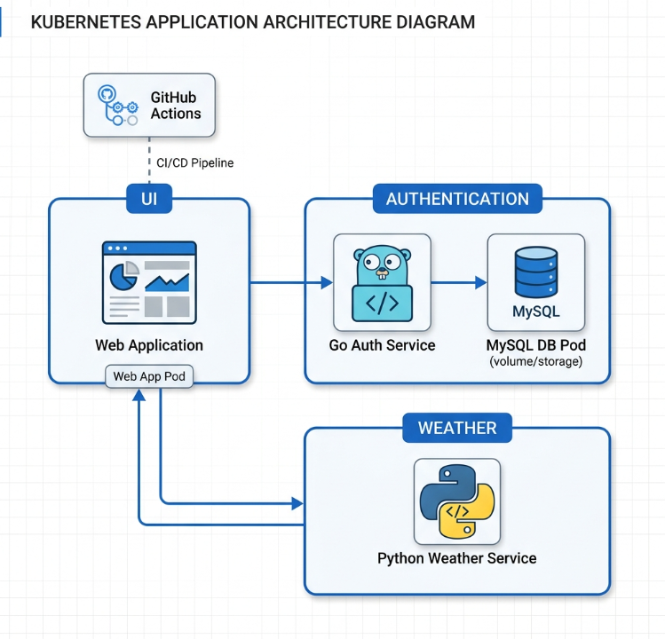

# 🌦️ WeatherApp: Advanced DevSecOps & Cloud-Native Deployment

[](images/image.png)

A comprehensive, multi-service weather application demonstration project. This project showcases a modern cloud-native architecture, leveraging **Infrastructure as Code (Terraform)**, **DevSecOps Pipeline automation (GitHub Actions)**, and **GitOps-driven deployment (ArgoCD)** on **Google Kubernetes Engine (GKE)**.

## 📱 Application Preview


---

## 🏗️ Architecture Overview

The application follows a microservices pattern, designed for scalability and separation of concerns:

-   **Frontend (UI):** A Node.js & Express application providing a responsive dashboard for users.
-   **Authentication (Auth):** A high-performance Go service managing user sessions and JWT-based security.
-   **Weather Core:** A Python/Flask microservice that interacts with third-party Weather APIs (RapidAPI).
-   **Database:** A Managed MySQL instance (via StatefulSet) for secure data persistence.

---

## 🛠️ Technology Stack

| Category | Tools & Technologies |
| :--- | :--- |
| **Cloud Provider** | Google Cloud Platform (GCP) |
| **Infrastructure** | Terraform, Google Kubernetes Engine (GKE), VPC, Subnets |
| **Microservices** | Go, Node.js (Express), Python (Flask) |
| **Containerization** | Docker, Docker Hub |
| **CI/CD** | GitHub Actions |
| **GitOps** | ArgoCD, ArgoCD Image Updater |
| **Security Scanning** | SonarQube, Trivy (Image Scan), OWASP Dependency-Check |
| **Networking** | NGINX Ingress Controller, ClusterIP Services |

---

## 🚀 DevSecOps Pipeline

The project implements a robust "Shift-Left" security approach through automated GitHub Actions pipelines for every service.

### Pipeline Stages:
1.  **Build & Test:** Multi-stage Docker builds to ensure minimal footprint and high performance.
2.  **Static Analysis (SAST):** Deep code inspection via **SonarQube** to identify bugs and code smells.
3.  **SCA Scanning:** **OWASP Dependency-Check** scans libraries for known vulnerabilities.
4.  **Container Auditing:** **Trivy** performs vulnerability scans on final Docker images.
5.  **Automated Tagging:** Seamless push to Docker Hub with unique commit-based tags.
6.  **Manifest Automation:** Automated updates to Kubernetes manifests in the repository to trigger GitOps sync.


---

## ☸️ GitOps Deployment (ArgoCD)

Deployment is strictly managed via **ArgoCD**, ensuring the cluster state always matches the repository's configuration.

-   **Automated Sync:** Automated `prune` and `self-heal` policies for high availability.
-   **Image Updater:** Automatically detects new Docker Hub images and propagates them to the K8s manifests via Git commits.
-   **Namespace Isolation:** Separate namespaces for `ui`, `authentication`, and `weather`.


---

## 🛠️ Recent Infrastructure Enhancements

We have recently upgraded the production-readiness of the deployment:

1.  **Traffic Routing:** Implemented an **NGINX Ingress Controller** for the UI, moving away from `NodePort` to a more secure `ClusterIP` architecture with centralized ingress.
2.  **GKE Storage Fix:** Resolved a critical MySQL initialization error in GKE. Automated the cleanup of the system-generated `lost+found` directory via a dedicated `initContainer` in the StatefulSet, ensuring smooth database booting on persistent volumes.
3.  **Security Patches:** Upgraded vulnerable Go JWT libraries and Node.js dependencies identified during SCA scanning.

---

## 🏁 Getting Started & Deployment

### 1. Infrastructure Provisioning
Navigate to the `Terraform/` directory and apply the configuration to spin up the GKE cluster:
```bash
terraform init
terraform plan
terraform apply
```

### 2. Configure Ingress
Ensure the NGINX Ingress Controller is installed in your cluster. The UI Ingress is pre-configured in `K8S/ui/ingress.yaml`.

### 3. ArgoCD Installation
Deploy the application manifests using the ArgoCD definitions found in the `argocd/` directory:
```bash
kubectl apply -f argocd/weather-app.yaml
```

---

## 📸 Project Gallery


---
*Created by [Mostafa Gheta](https://github.com/mostafagheta)*
